# ApexFit 3D - Kinetic Biometric Workout Matrix

<div align="center">

[](https://flutter.dev)
[](https://dart.dev)
[](https://github.com/inusah-ibraheem)
[](https://github.com/inusah-ibraheem)
[](LICENSE)

<p align="center">
  <strong>A high-octane 3D fitness and bodybuilding companion with real-time caloric gauges, workout planners, and trainer booking.</strong>
</p>

---

</div>

## 🌟 Visual Showcase & Screen Matrix

Every screen in this application has been crafted with custom **3D Spatial Elevation**, dynamic matrix transformations, and authentic domain-specific workflows.

| **01 Onboarding** | **02 Login** | **03 Dashboard** |
| :---: | :---: | :---: |
| 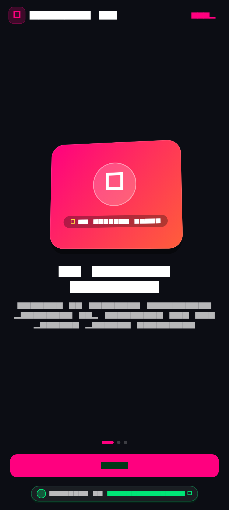 | 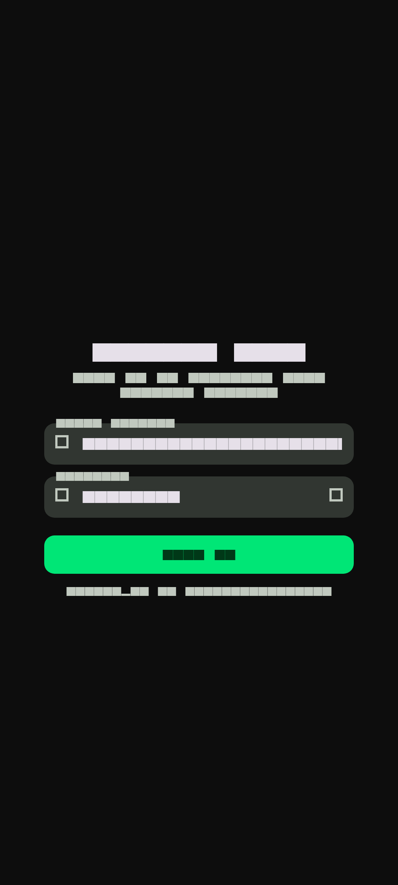 | 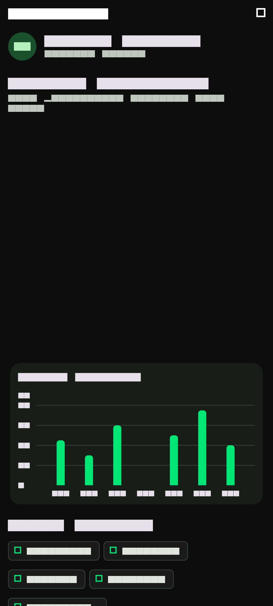 |

| **04 Workout Plans** | **05 Exercises** | **06 Progress** |
| :---: | :---: | :---: |
| 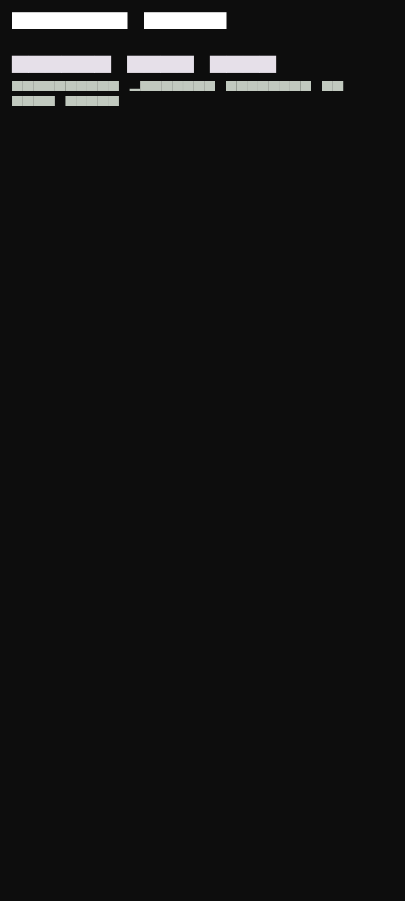 | 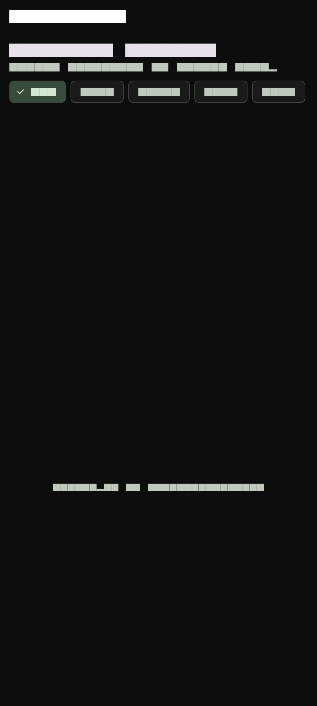 | 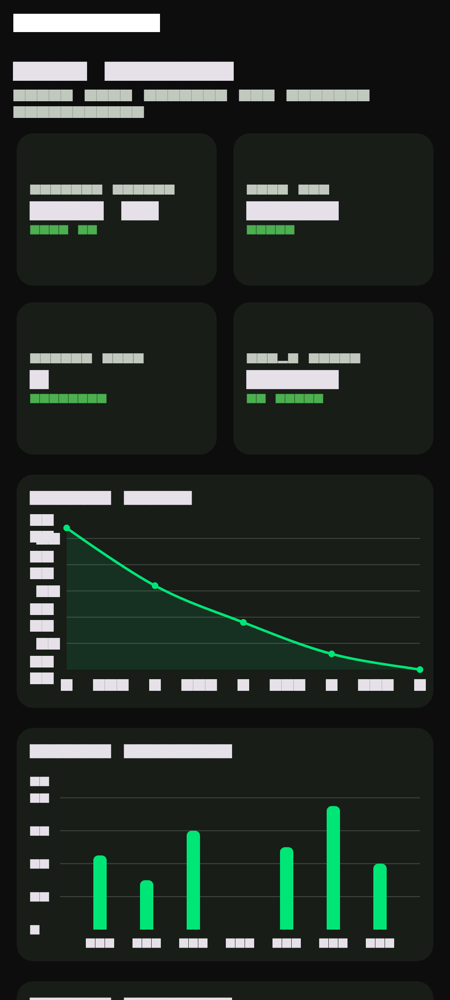 |

| **07 Calories** | **08 Diet** | **09 Schedule** |
| :---: | :---: | :---: |
| 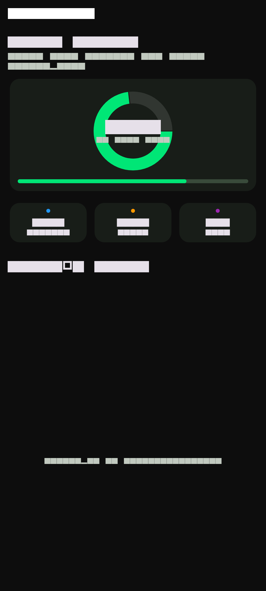 | 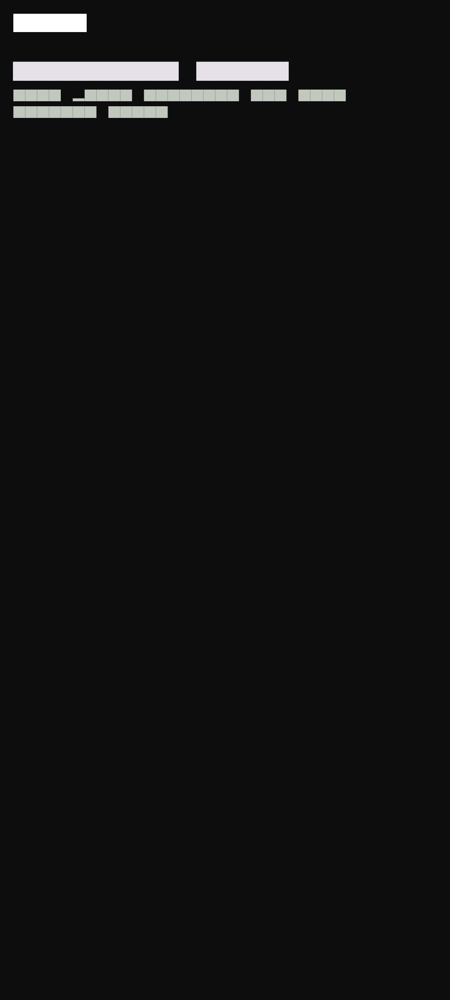 | 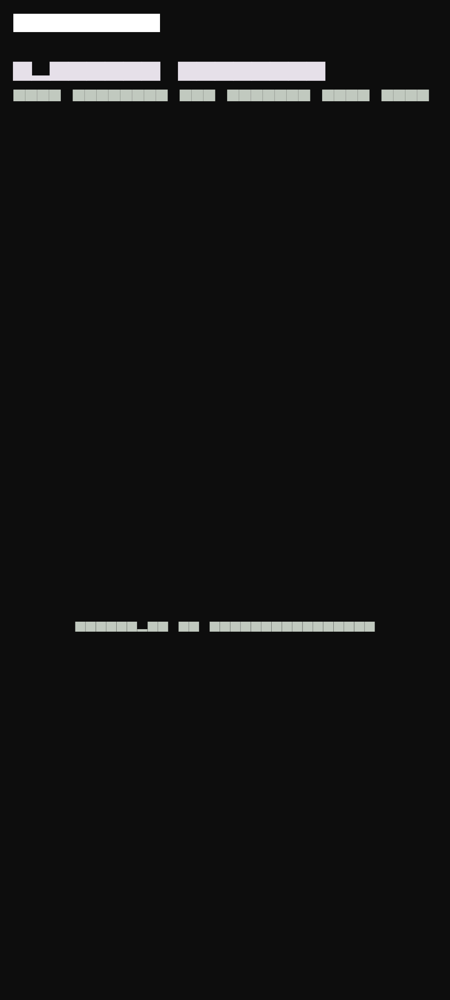 |

| **10 Trainer** | **11 Membership** | **12 Settings** |
| :---: | :---: | :---: |
| 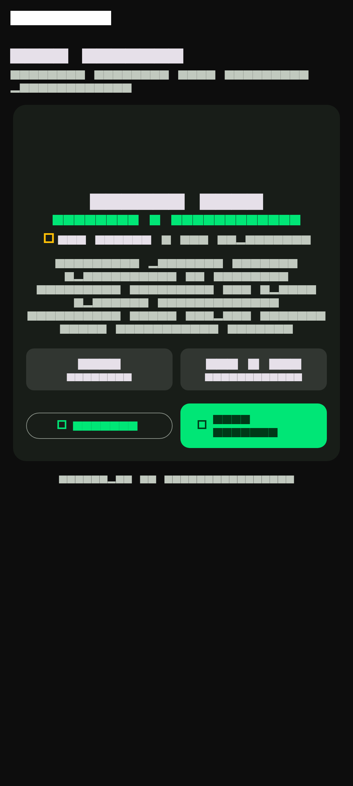 | 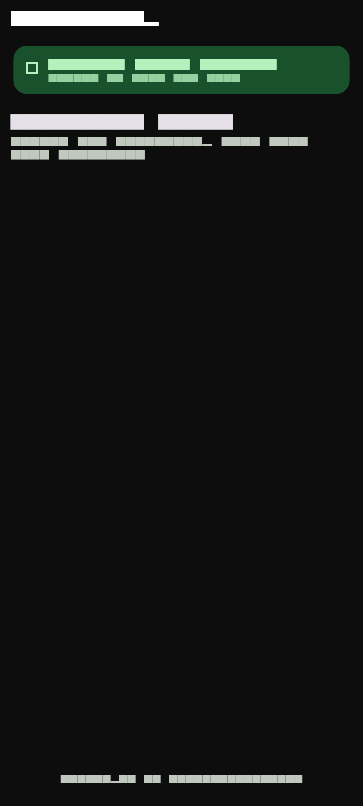 | 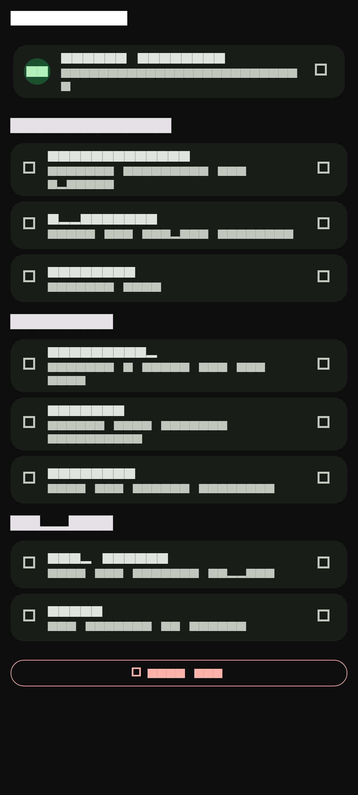 |


---

## ✨ Key Features & Experience Highlights

- **3D Kinetic Training Onboarding**: Dynamic avatar workouts and fitness goal trajectory setting.
- **Biometric Performance Dashboard**: Live calorie burn rings, heart-rate zones, hydration trackers, and rep counters.
- **Interactive Workout & Exercise Vault**: Categorized muscle group exercises with video guides and form tips.
- **VIP Elite Membership & Trainer Booking**: Certified coach scheduling, 1-on-1 consultations, and subscription tiers.
- **Verified Designer Branding**: Every fitness telemetry screen carries the `@inusah_ibraheem` designer verification.

---

## 🎨 Design System & Visual Tokens

- **Theme & Aesthetics**: Carbon Black & Neon Ultraviolet
- **Primary Accent**: `#A855F7`
- **Card Technology**: Custom Matrix4 3D Tilt with dynamic specular highlights and multi-stop drop shadows.
- **Typography**: Google Fonts with high-readability spatial weight distribution.
- **Micro-Interactions**: Haptic depth-press reactions, spring-physics curves, and smooth page transitions.
- **Designer Identity**: Certified `@inusah_ibraheem` profile watermark and verification badges.

---

## 🛠️ Architecture & Folder Structure

```text
Gym Fitness UI App/
├── assets/
│   ├── images/
│   │   └── profile.jpg          # Verified Designer Avatar
├── lib/
│   ├── core/                    # Theme, Constants, & Global Tokens
│   ├── features/                # Domain-Driven Screen Modules
│   ├── router/
│   │   └── app_router.dart      # Named Navigation Matrix
│   ├── widgets/
│   │   ├── three_d_card.dart    # Reusable Spatial 3D Card Engine
│   │   └── developer_footer.dart# Verified Designer Footer Widget
│   └── main.dart                # Application Entry Point
├── screenshots/                 # High-Resolution Screen Previews
└── pubspec.yaml                 # Dependency Manifest
```

---

## 🚀 Getting Started

### Prerequisites
- [Flutter SDK](https://flutter.dev/docs/get-started/install) (version 3.19.0 or higher recommended)
- [Dart SDK](https://dart.dev/get-dart)
- Android Studio / VS Code with Flutter Extension
- An active Android/iOS emulator or connected physical device

### Installation & Run

1. **Clone the Repository**:
   ```bash
   git clone https://github.com/inusah-ibraheem/flutter-3d-ui-suite.git
   cd "flutter-3d-ui-suite/Gym Fitness UI App"
   ```

2. **Install Dependencies**:
   ```bash
   flutter pub get
   ```

3. **Run the Application**:
   ```bash
   flutter run
   ```

---

## 👨‍💻 Designer & Author

<div align="center">
  
  <p><strong>Inusah Ibraheem</strong></p>
  <p><em>Creative Mobile Engineer & 3D Flutter Specialist</em></p>
  <p>
    <a href="https://github.com/inusah-ibraheem">GitHub: @inusah_ibraheem</a>
  </p>
</div>

---

## 📄 License

This project is licensed under the MIT License - see the [LICENSE](LICENSE) file for details.
